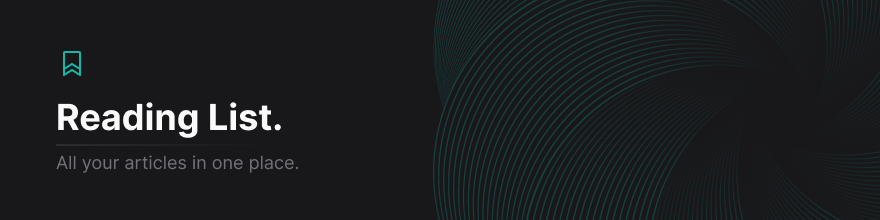

# Reading List
Find all your articles in one place.

---

## Table of Contents
- [About](#about)
- [Features](#features)
- [Technologies](#technologies)
- [Getting Started](#getting-started)

## About
Reading List is a decentralized application that allows users to save tech related articles to a community reading list. Initially, built as a tool for [João's](https://github.com/jpedroh) personal use, Reading List is now growing and becoming a community driven project.

## Features
- [x] Save articles to a community reading list
- [x] Add tags to articles
- [x] Filter articles by tags
- [x] Search articles by title
- [x] Dark mode
- [x] Responsive design

## Technologies
- [Next.js](https://nextjs.org/)
- [Tailwind CSS](https://tailwindcss.com/)
- [Drizzle](https://www.trufflesuite.com/drizzle)
- [Headless UI](https://headlessui.dev/)
- [PlanetScale](https://planetscale.com/)
- [Zod](https://zod.dev/)
- [Jotai](https://jotai.org/)
- [OTP](https://github.com/yeojz/otplib)
- [Nx](https://nx.dev/)
- [Playwright](https://playwright.dev/)
- [QRCode](https://github.com/soldair/node-qrcode)
- [Kysely](https://github.com/kysely-org/kysely)

## Getting Started

This is a [Next.js](https://nextjs.org/) project bootstrapped with [`create-next-app`](https://github.com/vercel/next.js/tree/canary/packages/create-next-app).

After cloning the repository, install the dependencies:

```bash
npm install
# or
yarn install
# or
pnpm install
```

Create a `.env.local` file similar to `.env.example` and add your variables. Whilst in production we use PlanetScale, however, you can use any MySQL database in development mode thanks to Drizzle and Kysely abstraction. See [Drizzle](https://www.trufflesuite.com/drizzle). Once you have your database setup, run the migrations:

```bash
npm run db:push
# or
yarn db:push
# or
pnpm db:push
```

Finally, run the development server:

```bash
npm run dev
# or
yarn dev
# or
pnpm dev
```
